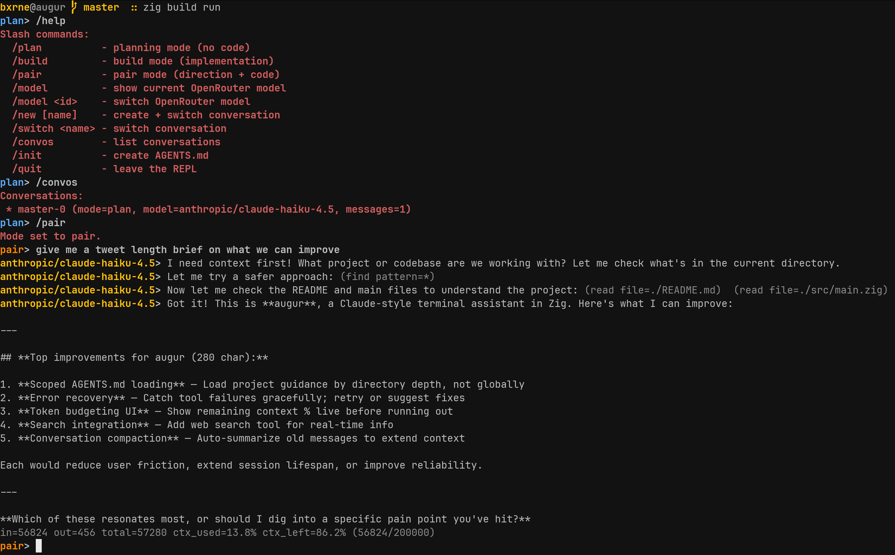

# augur

`augur` is a tiny Claude-style assistant client written in Zig. It talks to
OpenRouter, supports tool calling, and ships with a simple REPL.

This project started as the CodeCrafters course "Build your own Claude Code."



## Requirements

- Zig 0.15+
- An OpenRouter API key (`OPENROUTER_API_KEY`)

## Build

```sh
zig build
```

## Run a single prompt

```sh
# streams by default
OPENROUTER_API_KEY=... zig build run -- -p "Say hello"

# buffered output (shows a spinner in TTYs)
OPENROUTER_API_KEY=... zig build run -- -p "Say hello" --no-stream
```

## Start the REPL

```sh
OPENROUTER_API_KEY=... zig build run
```

Type `/quit` to leave the REPL.

Streaming is on by default; pass `--no-stream` to buffer responses. The REPL
uses ANSI colors when stdout is a TTY and starts in **plan** mode.
Conversations are persisted to `./augur/conversations.json` and switching
conversations restores their message history into the active context buffer.
After each response, augur prints a dimmed usage line with input/output tokens,
total tokens, context-window usage %, and the current adaptive tool-turn cap.

### Slash commands

Inside the REPL:

- `/plan` switches to plan mode (high-level steps, no code).
- `/build` switches to build mode (implementation + code).
- `/model` shows the current model.
- `/model <id>` changes the OpenRouter model.
- `/new [name]` creates and switches to a new conversation.
- `/switch <name>` switches to a saved conversation (loads its history into context).
- `/convos` lists all conversations.
- `/init` inspects the project and generates an `AGENTS.md`.
- `/quit` exits the REPL.
- `/help` shows the command list.

Prompts are prefixed with `mode>` (e.g. `plan>`) and assistant responses with `model@mode>`.

### Instruction files

Augur now detects repository skill guidance and appends it to the system prompt:

- `SKILLS.md`
- `SKILLS/*/SKILL.md`
- `.skills/*/SKILL.md`

When skills are present, the assistant is instructed to read relevant `SKILL.md` files before implementation.

## Environment variables

- `OPENROUTER_API_KEY` (required)
- `OPENROUTER_BASE_URL` (optional, defaults to `https://openrouter.ai/api/v1`)

## Tools

The assistant can call these tools:

- `read`: Read a file from disk.
- `write`: Write a file to disk.
- `bash`: Run a shell command and return stdout/stderr.

## Roadmap

- [x] Streamed responses (default)
- [x] Model choice
- [x] Plan and Build modes
- [x] Conversation persistence + switching
- [x] SKILLS discovery (`SKILLS.md`, `SKILLS/*/SKILL.md`, `.skills/*/SKILL.md`)
- [x] Streaming wait indicator before first token
- [x] Per-response token usage + context-window %
- [x] Adaptive tool-turn cap based on context usage
- [ ] Scoped AGENTS.md loading by directory tree
- [ ] Web search tool
- [ ] Subagents
